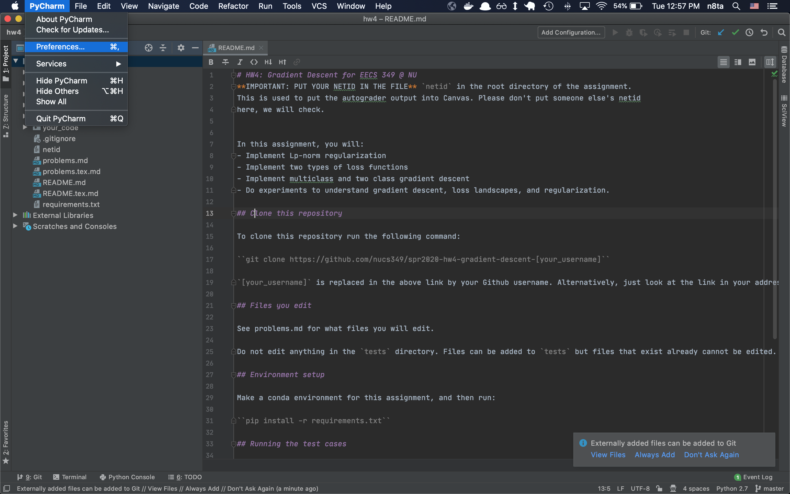
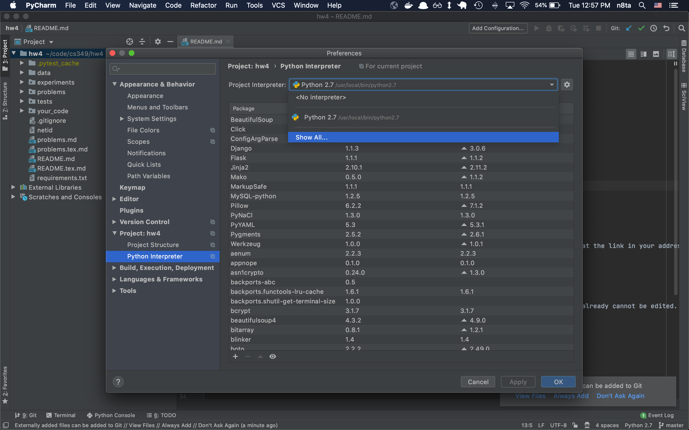
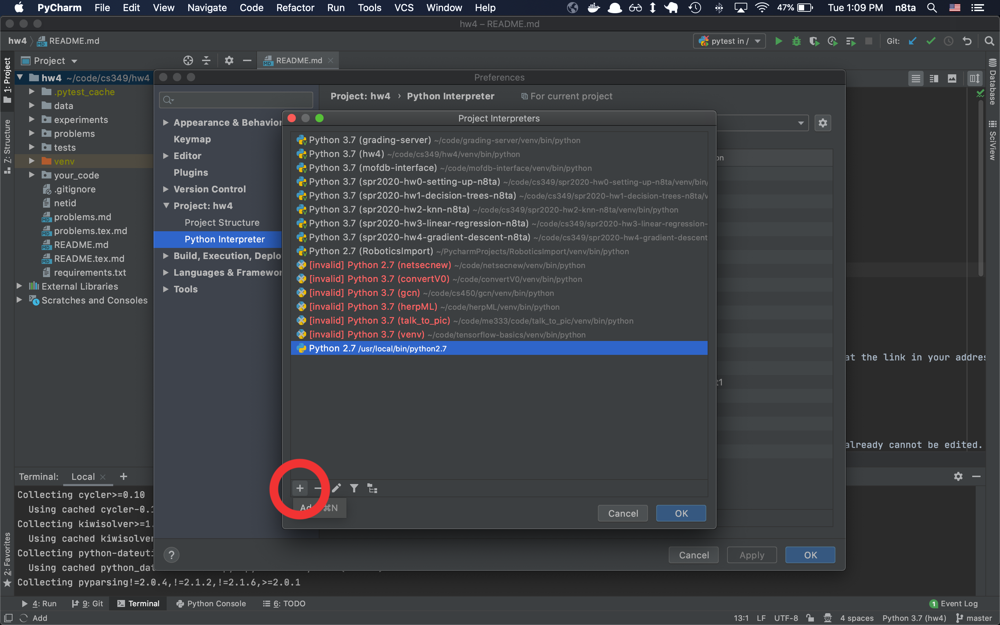
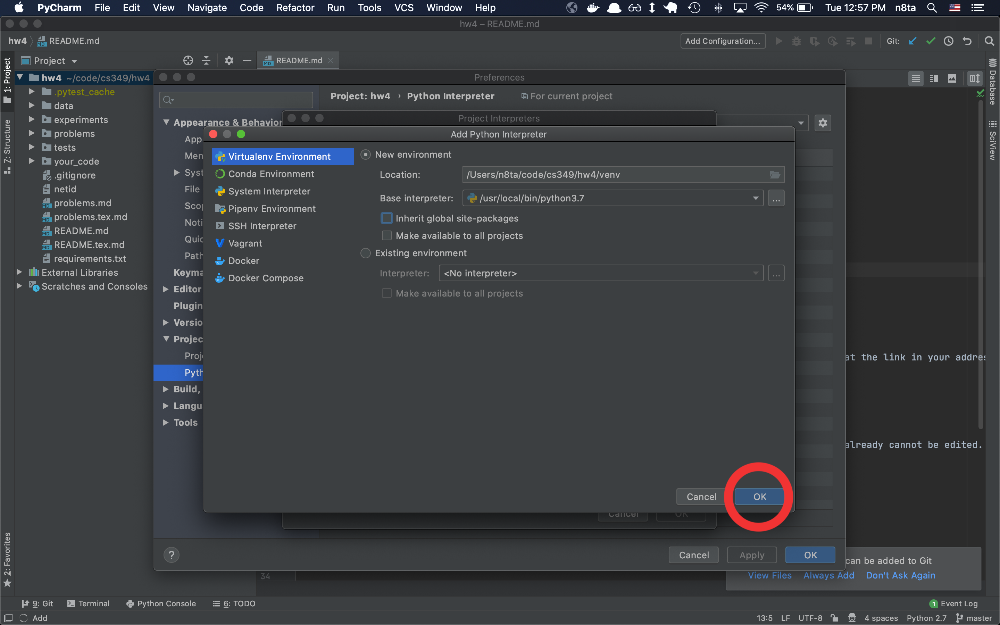
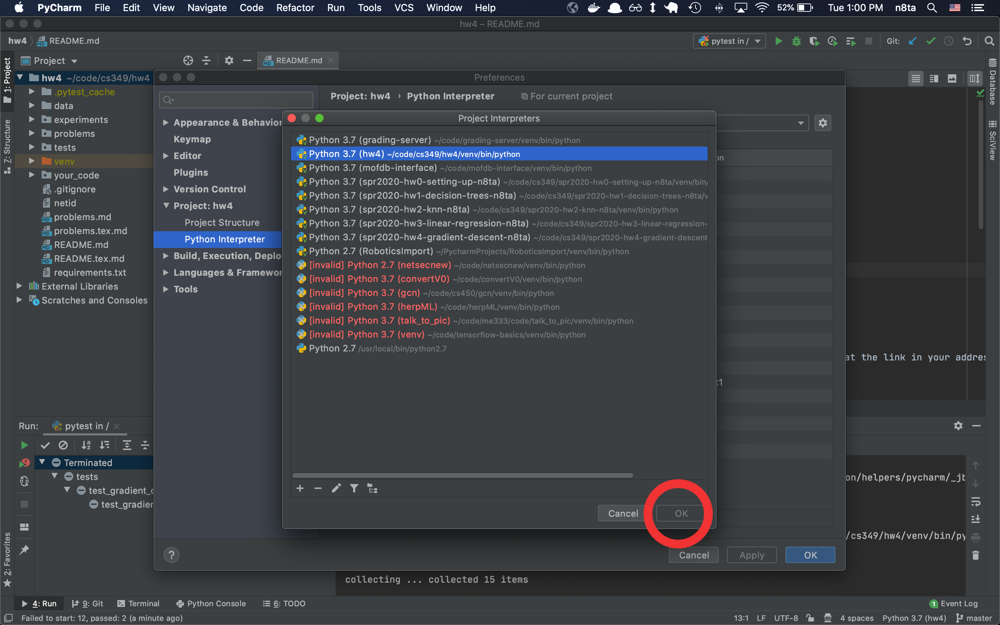
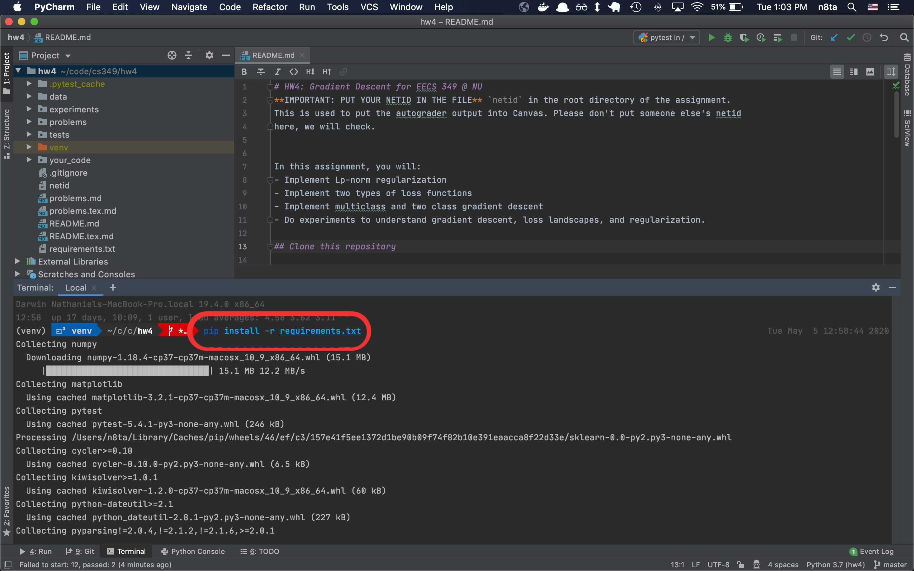
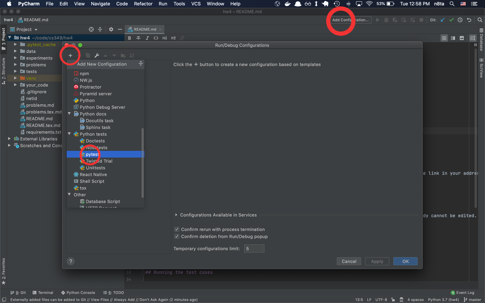
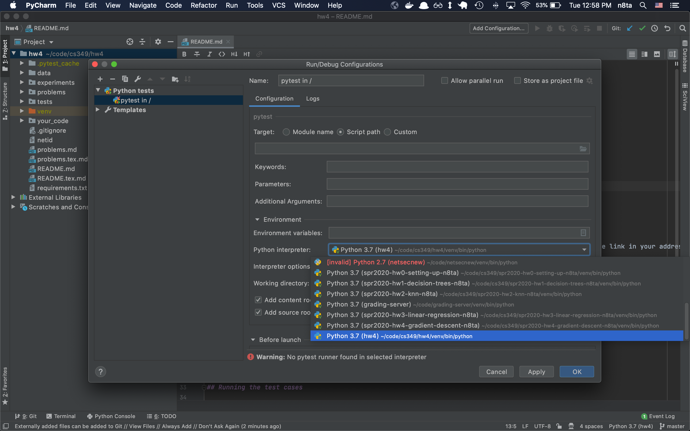
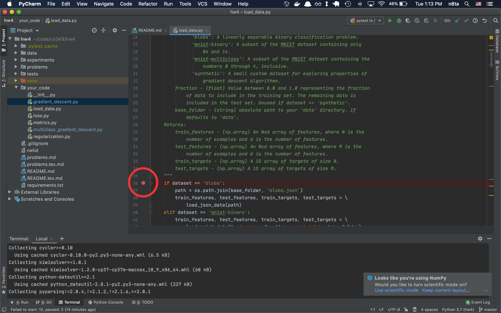

How to debug PyTests in PyCharm:

1. Open preferences

2. Click show all interpreters

3. Add new

4. Select base interpreter (python3)

5. Click okay

6. Install dependencies

7. Add a pytest configuration

8. Select the interpreter from earlier

9. Set a breakpoint

10. Click debug

11. Profit
